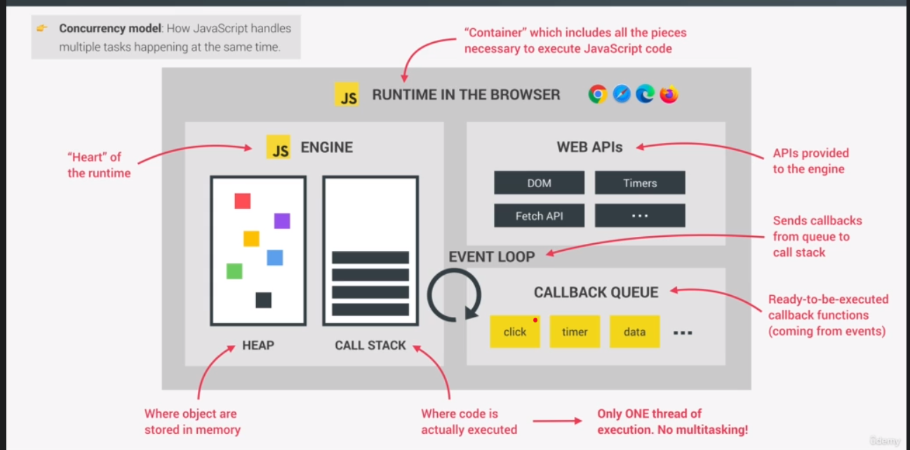
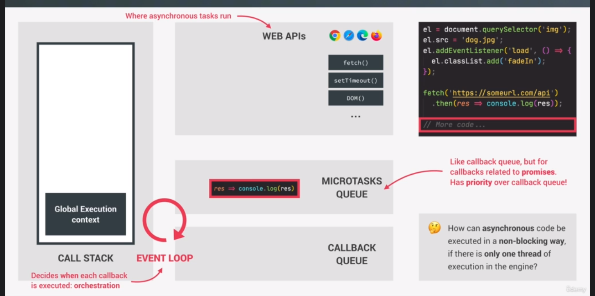
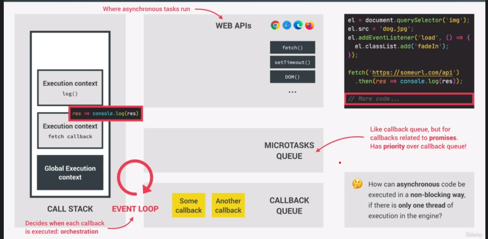

# What is javascript runtime?

- ans: Container which includes all the pieces necessary to execute JS code

# What is JS engine?

- ans: the heart of the runtime

# Engine has two _BOX_

1. THE HEAP: where object stored in memory (in an unconnected way)
2. THE CALL STACK : where the code is actually executed
   => 1 thread of execution.

# Web APIs

- APi provided to the engine
- but its not the part of js
- DOM, timer, fetch API, GEOlocation...

# Callback queue

- ans: hold all ready to be executed callback function that are attached to some event that has occurred
  => when the CALL STACK is empty => eventloop take Callback in the callback queue => put them into callstack so they can be executed.

# Event loop ♻️

- ans: the essential piece make async behavior possible in JS
- concurrency model : how the langues handle multiple thing happening at the same time

## How async code be executed in a non blocking way?

- runtime manage all the async behavior
- event loop decide which code will be execute next
- the web Apis or the Node pool will do it in the background

=> **Promise will not move to the CALLBACK QUEUE**
=> **It has a queue for themselves, it's called microtask queue**

## So, What is microtask queue?

=> it basically has priority over the callback queue.
=> at the end of evenloop tick (_means after event loop take cb to runtime_), event loop will check if any callbacks in the microtask queue, if there are, it will run all of them (_promise_) before it will run any more callbacks from the regular callback queue

